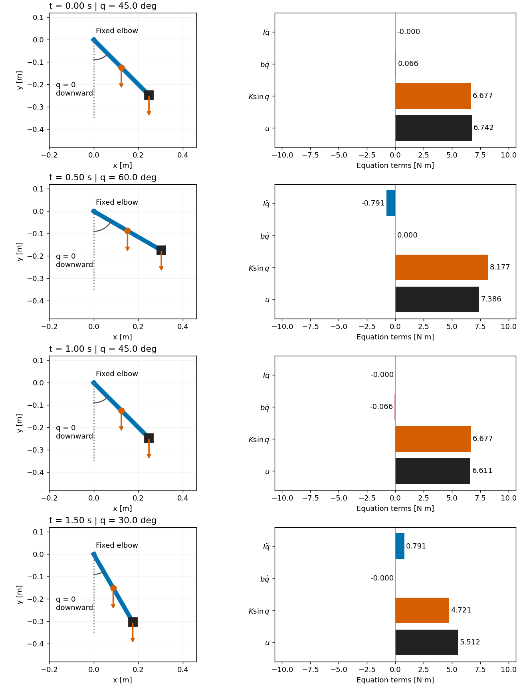

# 從一隻手臂推導運動方程

本章的問題是：**手拿啞鈴，靜止與加速時，需要的關節力矩有何不同？** 我們先建立可以手算的模型，再寫出求解演算法。單擺的標準方程可參照 MIT 的推導；以下將質點擺改成具有轉動慣量的肢段與末端負重，逐步算出各項。[^1]

## 🎯 1. 先定義我們正在模擬什麼

上臂固定，肘的位置固定於慣性座標系原點，前臂與手合併為一個剛體，在垂直平面內旋轉。啞鈴簡化為距離肘 $L$ 的質點。沒有肌肉收縮動態、關節接觸或活動範圍限制。本章的 $q$ 是這個教學模型的角度，不能直接當成實驗或軟體中的肘屈曲角。

令水平向右為 $x$ 正向、垂直向上為 $y$ 正向。$q=0$ 表示手臂垂直下垂；$q$ 增加時，手向右上方旋轉。因此從 $+x$ 指向 $+y$ 的平面逆時針方向是正方向。所有微分與程式內部角度都用 rad。

| 符號 | 意義 / English | 本章數值與單位 |
|---|---|---|
| $m$ | 肢段質量 / segment mass | 1.5 kg |
| $L$ | 肘到負重距離 / load distance | 0.35 m |
| $c$ | 肘到肢段質心距離 / COM distance | 0.175 m |
| $I_c$ | 肢段繞質心的轉動慣量 / COM inertia | $mL^2/12=0.0153125$ kg·m² |
| $m_d$ | 負重質量 / load mass | 2 kg |
| $g$ | 重力加速度大小 / gravity | 9.81 m/s² |
| $b$ | 黏性阻尼係數 / viscous damping | 0.08 N·m·s/rad |
| $u$ | 理想驅動力矩 / actuator torque | N·m，正向同 $q$ |

均勻桿只用來設定這組合成參數的 $c$ 與 $I_c$；後續公式允許其他質心與慣量。不要把這組值解讀為人體測量資料。

**停下來想：** $q=\pi/2$ 時手在哪裡？答案是肘的右方，前臂水平。重力應產生負向力矩；這是稍後檢查符號的基準。

## 📐 2. 從位置算出力矩

質心與負重的位置分別為

$$\mathbf r_c=(c\sin q,-c\cos q),\qquad
\mathbf r_d=(L\sin q,-L\cos q).$$

平面力矩是向量叉積的 $z$ 分量：$\tau_z=xF_y-yF_x$。重力沒有水平分量，因此

$$\tau_g=(c\sin q)(-mg)+(L\sin q)(-m_dg)
=-(mc+m_dL)g\sin q.$$

定義 $K=(mc+m_dL)g$，單位 N·m，則 $\tau_g=-K\sin q$。這個 $K$ 是重力力矩的幅度，**不是彈簧常數**。

繞肘的慣量要包含肢段自身旋轉與質心平移的貢獻：

$$I=I_c+mc^2+m_dL^2=0.30625\ \mathrm{kg\,m^2}.$$

現在使用繞固定肘軸的角動量平衡。阻尼力矩為 $-b\dot q$，所以

$$I\ddot q=u-b\dot q-K\sin q,$$

或等價地寫成

$$\boxed{I\ddot q+b\dot q+K\sin q=u.}$$

左側三項依序是慣性項、阻尼項、重力補償項。請注意：**$K\sin q$ 是移到左側的項，真正的重力力矩是 $-K\sin q$。** 動畫的色條顯示左側公式項，不能把每條色條都當成作用在手臂上的外力矩。

肘軸的支承反力對肘的力矩為零，因此不出現在這條轉動方程。這不表示支承反力為零，也不表示我們已經求出關節接觸力。

**停下來想：** 下垂時重力力矩為零；水平時靜止需要 $u=K=9.442125$ N·m。若此時取消驅動與速度，$\ddot q=-K/I\approx-30.8314$ rad/s²，方向應朝下。

## 🧮 3. 再從能量獨立推一次

質心速度為 $\dot{\mathbf r}_c=(c\cos q\dot q,c\sin q\dot q)$，平方長度為 $c^2\dot q^2$。所以肢段的平移動能是 $mc^2\dot q^2/2$，自身旋轉動能是 $I_c\dot q^2/2$；再加負重的動能：

$$T=\frac12(mc^2+I_c+m_dL^2)\dot q^2=\frac12I\dot q^2.$$

令下垂姿態的位能為零，質心與負重各上升 $c(1-\cos q)$ 與 $L(1-\cos q)$，因此

$$V=K(1-\cos q),\qquad \mathcal L=T-V.$$

有非保守廣義力 $Q=u-b\dot q$ 的 Euler–Lagrange 方程為

$$\frac{d}{dt}\left(\frac{\partial\mathcal L}{\partial\dot q}\right)
-\frac{\partial\mathcal L}{\partial q}=Q.$$

這裡 $q$ 與 $\dot q$ 在偏微分時當作獨立變數；算完後再沿時間軌跡取全導數：

$$\frac{\partial\mathcal L}{\partial\dot q}=I\dot q,
\qquad \frac{d}{dt}(I\dot q)=I\ddot q,
\qquad \frac{\partial\mathcal L}{\partial q}=-K\sin q.$$

代回即得到 $I\ddot q+K\sin q=u-b\dot q$，與上一節相同。$I$ 能移出時間導數，是因為本模型的 $I$ 是常數；多關節模型不能直接套用這一步。

這一節使用 Euler–Lagrange 方程，尚未從變分原理證明它。完成本章後，[Stage 1 筆記](../01_math_foundations/notes.md) 會補上作用量與變分推導。

## 💻 4. 從方程變成演算法

### 逆向動力學：給動作，求力矩

選一條合成動作（$t$ 以秒計）：

$$q(t)=\frac\pi4+\frac\pi{12}\sin(\pi t),$$
$$\dot q(t)=\frac{\pi^2}{12}\cos(\pi t),\qquad
\ddot q(t)=-\frac{\pi^3}{12}\sin(\pi t).$$

把三個值代入即可得到 $u(t)$，不用數值微分。這條軌跡在 30° 到 60° 間往返，週期 2 秒。給定動作不是前向模擬；動畫會明確標示它是指定軌跡及所需力矩。

### 前向動力學：給力矩，求動作

定義狀態 $\mathbf x=[q,v]^T$，其中 $v=\dot q$。二階方程改寫成

$$\dot{\mathbf x}=f(t,\mathbf x)=
\begin{bmatrix}v\\[u(t)-bv-K\sin q]/I\end{bmatrix}.$$

積分器需要初始角度與初始速度。重建上述動作時，$q(0)=\pi/4$、$v(0)=\pi^2/12$，初速度不是零。

```python
def rhs(t, state):
    q, v = state
    acceleration = (torque(t) - b * v - K * np.sin(q)) / I
    return [v, acceleration]
```

Notebook 使用 `solve_ivp` 的 DOP853 方法。求解器在內部選擇步長；`t_eval` 是要求輸出的時間點，不等於內部積分步長。用相同的已知力矩與正確初始狀態積分，應重建原軌跡；這是在檢查演算法，不是在證明人體會採取這條動作。

## 🎞️ 5. 用動畫讀懂公式



*圖 1：所有畫格取自同一組數據。左圖是固定肘的姿態與向下的重力方向；右圖是公式各項的帶符號數值，單位 N·m。箭頭只表示方向，不按力量縮放。*

Notebook 動畫把「幾何位置」「帶數值的運動方程」「完整力矩曲線與當前時間」放在同一畫面。先暫停在 $t=0.5$ s：此時角度最大、速度為零，但加速度不為零。從色條確認阻尼項消失，慣性項仍存在。

接著看 $t=1.5$ s：角度最小且瞬間速度為零，加速度轉為正值。比較兩個時刻，就能看見「瞬間不動」和「維持靜止」的差別。

動畫模組與物理模型分開，後續可替換為雙擺、Jacobian 或肌肉力矩分解；擴充要求見 [動畫製作規格](../ANIMATION_GUIDE.md)。

## ✅ 6. 檢查物理，而不只檢查程式能跑

總機械能 $E=T+V$ 的導數為

$$\dot E=I\dot q\ddot q+K\sin q\dot q
=u\dot q-b\dot q^2.$$

因此無驅動、無阻尼時能量應守恆；無驅動且 $b>0$ 時能量應不增加。積分形式為

$$E(t)-E(0)=\int_0^t u\dot q\,dt-\int_0^t b\dot q^2\,dt.$$

| 檢查 | 預期 | 能抓到什麼 |
|---|---|---|
| 水平靜力 | $u=9.442125$ N·m | 重力符號、長度與單位錯誤 |
| 無重力、無阻尼、定力矩 | $q=q_0+v_0t+ut^2/(2I)$ | 狀態順序、積分或初值錯誤 |
| 無驅動、無阻尼 | $E(t)=E(0)$ | 能量或方程實作錯誤 |
| 指定動作前向重建 | 恢復 $q(t)$ | 前向／逆向介面不一致 |
| 調緊求解器容差 | 與解析或高精度參考的誤差下降趨勢 | 數值結果是否足夠收斂 |

前向與逆向若共用錯誤方程，也可能互相吻合，因此不能只做往返檢查。能量守恆同樣不是充分條件。計算實作的驗證（verification）與模型能否回答實際問題的效度評估（validation）必須區分；後者還需要與研究目的相關的獨立實驗證據。[^2]

## 🔬 7. 通往肌肉與研究方法

若只假設一條肌肉、固定正力臂 $r=0.04$ m，並假設該肌肉獨自提供水平靜止所需的力矩，則 $F=u/r=236.053125$ N。這只是條件式估計，沒有從角度資料辨識出真實肌肉力。

加入拮抗肌後，$u=r_fF_f-r_eF_e$。一條方程含兩個未知數；增加互相抵銷的肌肉力也能維持相同淨力矩。後續的最佳化章節將處理如何選解，以及選解準則對研究結論的影響。

若用一組動作估計模型參數，可寫成

$$u(t)=\begin{bmatrix}\ddot q(t)&\dot q(t)&\sin q(t)\end{bmatrix}
\begin{bmatrix}I\\b\\K\end{bmatrix}.$$

把多個時間點堆成矩陣 $Y$，得到 $\mathbf u=Y\boldsymbol\theta$。即使可以算最小平方法，也要先問 $Y$ 是否有足夠的獨立欄位：只有靜止姿態時，前兩欄都是零，無法估計 $I$ 與 $b$。這就是從「會執行模擬」走向「會設計方法」的第一個問題。

## 📚 8. 練習與參考

完成 [練習與參考解](exercises/exercises.md)，再閱讀 [Stage 1](../01_math_foundations/README.md)。下一個難點是 $I$ 如何擴充為依姿態改變的 $M(q)$，以及關節之間如何產生慣性耦合。

[^1]: Russ Tedrake. *Underactuated Robotics*, Ch. 2: The Simple Pendulum. https://underactuated.csail.mit.edu/pend.html 。對應單擺的重力、阻尼與力矩方程；本章合成參數與肢段算例為教材自建。
[^2]: Hicks et al. (2015). *Is My Model Good Enough? Best Practices for Verification and Validation of Musculoskeletal Models and Simulations of Movement*. https://pmc.ncbi.nlm.nih.gov/articles/PMC4321112/ 。對應計算驗證與模型效度的區分。
