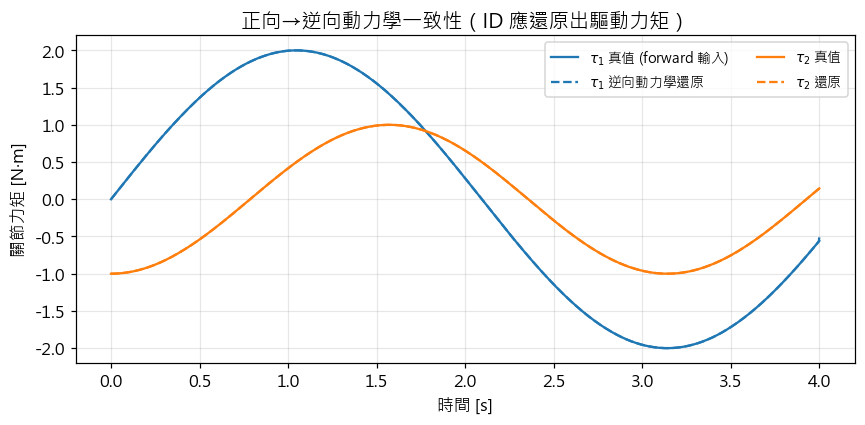
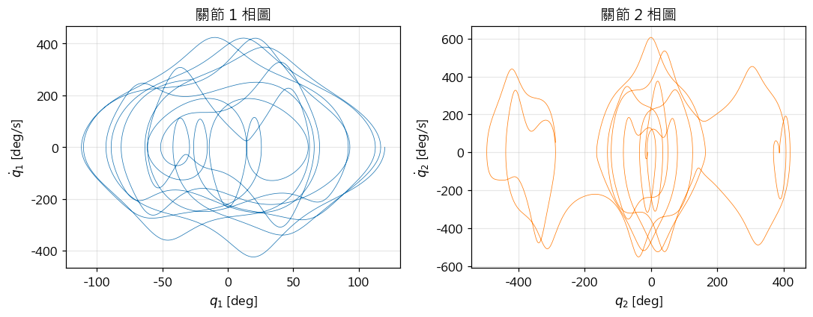
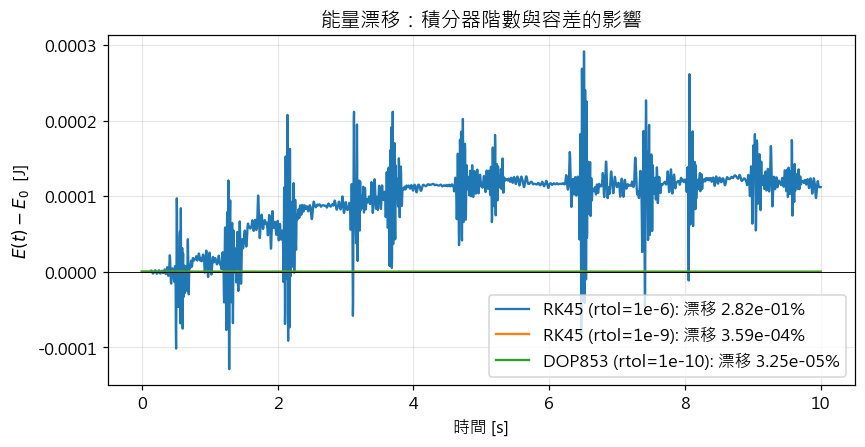
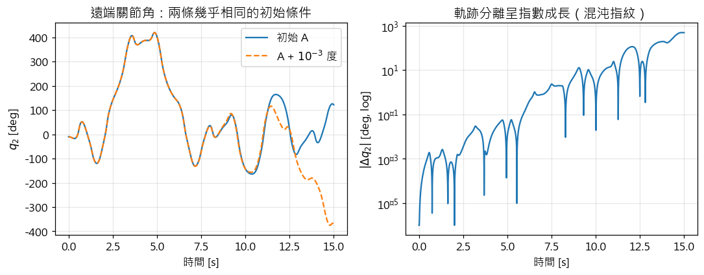
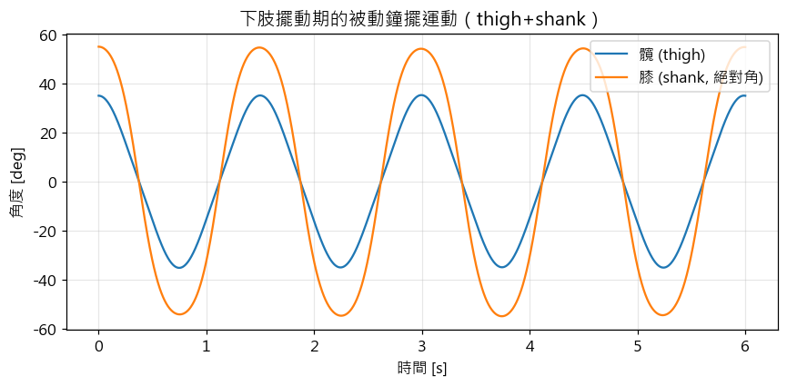

# Stage 1 · 數學基礎 — 筆記 (Math Foundations)

> **範圍**：本檔為 Stage 1 的理論筆記，涵蓋**第一部分：古典力學與拉格朗日動力學**。
> 對應 notebook：[`notebooks/01_lagrangian_double_pendulum.ipynb`](notebooks/01_lagrangian_double_pendulum.ipynb)。
> 第二、三部分（四元數 / $SO(3)$、Hamilton 相空間）待後續補上。
>
> 公式以 GitHub 原生 MathJax 撰寫（`$...$` 行內、`$$...$$` 展示）。

---

## 0. 為什麼從這裡開始？（Stage 1 在整條路徑中的定位）

肌肉骨骼模擬的每一層都建立在一條運動方程之上：

$$
M(q)\,\ddot q + C(q,\dot q)\,\dot q + g(q) = \tau .
$$

| 出現的地方 | 形式 |
|---|---|
| Stage 2 多體動力學 | 用 RNEA / CRBA / ABA **有效率地**組出同一條方程 |
| Stage 3/5 OpenSim 逆向動力學 | $\tau = M\ddot q + C\dot q + g - J^\top F_{\text{ext}}$（多了地面反作用力） |
| Stage 6 靜態最佳化 | $\sum_i a_i F^M_i(q,\dot q)\,r_i(q) = \tau_{\text{net}}$（把 $\tau$ 分配給肌肉） |
| Stage 8 Moco 軌跡最佳化 | 把 $\dot x = f(x,u)$ 作為 collocation 的動力學約束 |

Stage 1 的任務就是**親手、從第一原理推出這條方程**，並理解它每一項的物理意義。
本部分用**雙擺 (double pendulum)** 當載體——它是最小的多關節肢段模型。

---

## 1. 廣義座標與自由度 (Generalized coordinates & DOF)

- **構型 (configuration)**：描述系統在某瞬間「長什麼樣」所需的資訊。
- **自由度 (degrees of freedom, DOF)**：唯一決定構型所需的**最少獨立座標數**。
- **廣義座標 (generalized coordinates)** $q = (q_1,\dots,q_n)$：一組獨立、能完整描述構型的座標。
  對關節式系統，最自然的選擇就是**關節角**。

平面雙擺有 $n=2$ 個 DOF：兩個關節角 $q_1,q_2$。本課程一律把角度從**向下鉛垂線**量起，
使垂懸靜止對應 $q=0$。

> **生物力學連結**：Freivalds（2011, Ch. 5）把上肢建成連桿系統時，肩、肘、腕各自貢獻 DOF；
> OpenSim 模型的 `coordinate` 就是這裡的廣義座標。選對座標（關節角而非笛卡兒座標）
> 會讓約束自動滿足——這是 Lagrangian 法相較 Newton–Euler 法的一大優勢。

---

## 2. 最小作用量原理與 Euler–Lagrange 方程

### 2.1 拉格朗日量

$$
\boxed{\;L(q,\dot q,t) = T(q,\dot q) - V(q)\;}
$$

$T$ 為動能、$V$ 為位能。

### 2.2 作用量與 Hamilton 原理

定義**作用量 (action)**

$$
S[q] = \int_{t_1}^{t_2} L\big(q(t),\dot q(t),t\big)\,dt .
$$

**Hamilton 最小作用量原理**：在固定端點 $q(t_1),q(t_2)$ 下，真實運動使 $S$ 取**駐值** $\delta S = 0$。

### 2.3 變分導出

令 $q\to q+\delta q$（且 $\delta q(t_1)=\delta q(t_2)=0$），一階變分

$$
\delta S = \int_{t_1}^{t_2}\sum_i\left(\frac{\partial L}{\partial q_i}\delta q_i
        + \frac{\partial L}{\partial \dot q_i}\delta \dot q_i\right)dt .
$$

對第二項分部積分，利用端點 $\delta q=0$，得

$$
\delta S = \int_{t_1}^{t_2}\sum_i\left(\frac{\partial L}{\partial q_i}
        - \frac{d}{dt}\frac{\partial L}{\partial \dot q_i}\right)\delta q_i\,dt .
$$

因 $\delta q_i$ 任意，被積式須為零，得 **Euler–Lagrange 方程**：

$$
\boxed{\;\frac{d}{dt}\!\left(\frac{\partial L}{\partial \dot q_i}\right)
      - \frac{\partial L}{\partial q_i} = Q_i,\qquad i=1,\dots,n\;}
$$

$Q_i$ 為**非保守廣義力**。**在生物力學裡 $Q_i = \tau_i$ 即淨關節力矩**
（保守的重力已由 $V$ 表達，不重複計入）。

> **為何生物力學偏好 Lagrangian？** 只需純量 $T,V$（不必畫每個連桿的自由體圖與內部約束力），
> 且以關節角為座標時**約束自動滿足**。代價是符號代數較繁——所以我們用 SymPy 代勞
> （見 `src/dynamics_utils.py`）。

---

## 3. 雙擺的完整推導

### 3.1 幾何與運動學（複合連桿 / compound-link 版本）

連桿 $i$：質量 $m_i$、長度 $L_i$、質心距近端關節 $c_i$、對**質心**的轉動慣量 $I_i$。
（點質量擺是 $c_i=L_i,\ I_i=0$ 的特例。）

關節位置沿鏈累加：

$$
X_i = \sum_{k\le i} L_k\sin q_k,\qquad Y_i = -\sum_{k\le i} L_k\cos q_k .
$$

連桿 $i$ 質心：

$$
x_{c_i} = X_{i-1} + c_i\sin q_i,\qquad y_{c_i} = Y_{i-1} - c_i\cos q_i .
$$

用**絕對角**（相對於慣性鉛垂線）時，連桿 $i$ 的角速度恰為 $\dot q_i$。

### 3.2 能量

$$
T = \sum_i\left[\tfrac12 m_i\big(\dot x_{c_i}^2 + \dot y_{c_i}^2\big) + \tfrac12 I_i\dot q_i^2\right],
\qquad
V = \sum_i m_i\,g\,y_{c_i} .
$$

### 3.3 運動方程（$n=2$，點質量特例）

代入 Euler–Lagrange 並整理成矩陣型式 $M(q)\ddot q + C(q,\dot q)\dot q + g(q) = \tau$：

$$
M(q) = \begin{bmatrix}
(m_1+m_2)L_1^2 & m_2 L_1 L_2\cos(q_1-q_2)\\
m_2 L_1 L_2\cos(q_1-q_2) & m_2 L_2^2
\end{bmatrix},
$$

$$
C(q,\dot q)\dot q = \begin{bmatrix}
 m_2 L_1 L_2\,\dot q_2^2\sin(q_1-q_2)\\
-m_2 L_1 L_2\,\dot q_1^2\sin(q_1-q_2)
\end{bmatrix},\qquad
g(q) = \begin{bmatrix}
(m_1+m_2)g L_1\sin q_1\\
m_2 g L_2\sin q_2
\end{bmatrix}.
$$

**一般（複合連桿）** 的對角項為 $M_{11}=I_1+c_1^2 m_1 + L_1^2 m_2$、$M_{22}=I_2+c_2^2 m_2$，
非對角項為 $M_{12}=L_1 c_2 m_2\cos(q_1-q_2)$（見 notebook 中 SymPy 導出的 `M_sym`）。

### 3.4 每一項的物理與生物力學意義

- **$M(q)$ 質量／慣性矩陣**：對稱正定（因動能為正定二次型），故 $\ddot q = M^{-1}(\tau - C\dot q - g)$
  必可解——正向動力學**良置**。
- **非對角 $M_{12}$（慣性耦合）**：動一個關節會在另一個關節產生力矩。這就是 Zatsiorsky（2012）
  所稱的 **interaction / interactive torque**；在快速多關節動作（投擲、踢擊）中，
  遠端關節的角加速度有很大比例來自近端關節的「甩動」，而非局部肌肉力。
- **$C(q,\dot q)\dot q$ Coriolis／向心項**：與速度平方成正比的慣性效應。
- **$g(q)$ 重力項**：靜態姿勢下肌肉必須抵抗的力矩，逆向動力學裡常單獨分離出「重力貢獻 vs 肌肉貢獻」。
- **$\tau$ 廣義力**：$\tau_i = \sum_{\text{muscle }j} r_{ij}(q)\,F^M_j$，其中 $r_{ij}$ 為肌肉 $j$
  對關節 $i$ 的**力臂 (moment arm)**（Zatsiorsky 2012, Ch. 5）。**雙關節肌**（Ch. 6）同時貢獻 $\tau_1$ 與 $\tau_2$（詳見 §4）。

### 3.5 Coriolis 矩陣與 $\dot M - 2C$ 反對稱性（第二個正確性檢驗）

§3.3 只寫了向量 $C(q,\dot q)\dot q$；但 $C$ **矩陣**本身值得單獨定義——它給我們一個**與能量守恆互補、純代數且逐點成立的正確性檢驗**。用第一類 Christoffel 符號建構：

$$
C_{ij}(q,\dot q) = \sum_{k}\tfrac12\!\left(\frac{\partial M_{ij}}{\partial q_k}
      + \frac{\partial M_{ik}}{\partial q_j} - \frac{\partial M_{jk}}{\partial q_i}\right)\dot q_k .
$$

這樣選出的 $C$ 有兩個關鍵性質：它滿足 $C(q,\dot q)\dot q$ 恰為 §3.3 的速度相關項向量，且

$$
\boxed{\;\dot M(q) - 2\,C(q,\dot q)\ \text{為反對稱}\;}\qquad\Longleftrightarrow\qquad \dot M = C + C^\top .
$$

**為何這是「能量守恆的代數根源」**：對被動系統的動能 $T=\tfrac12\dot q^\top M\dot q$ 取時間導數，代入運動方程 $M\ddot q = \tau - C\dot q - g$（並用 $g=\partial V/\partial q$）：

$$
\frac{dE}{dt} = \dot q^\top\tau
      + \underbrace{\tfrac12\,\dot q^\top(\dot M - 2C)\,\dot q}_{=\,0\ (\text{反對稱二次型})} = \dot q^\top\tau .
$$

於是 $\tau=0$ 時 $\dot E=0$——這正是 §6.2 能量守恆檢驗背後的**定理**，而非數值巧合。

> **生物力學／控制意涵**：此性質即**被動性 (passivity)**，是 Stage 7 CMC 等控制器穩定性的基石。
> 實作上 `dynamics_utils.py` 的 `coriolis_matrix()` 以符號 Christoffel 建構，`tests/` 逐點驗證 $\dot M-2C$ 反對稱。
> 它是比能量守恆**更強、且與積分器無關**的檢驗（混沌下能量守恆只是必要條件）。

---

## 4. 從關節力矩到肌肉力：力臂、冗餘與雙關節肌

§1–§3 把運動一路整理到廣義力 $\tau$。但在肌肉骨骼系統裡 $\tau$ **並不是輸入**——它是肌肉群透過力臂
**合成**出來的結果。這一節把 $\tau$ 打開，是 Stage 6（肌肉冗餘、靜態最佳化）的直接起點。

### 4.1 力臂的虛功／肌腱位移定義

設肌肉 $j$ 的肌腱-肌肉路徑長為 $\ell_j(q)$。由**虛功原理**，肌力 $F^M_j$ 沿肌腱做的虛功，
等於它在各關節產生的廣義力所做的虛功：

$$
F^M_j\,\delta\ell_j = \sum_i \tau_{ij}\,\delta q_i,\qquad
\delta\ell_j = \sum_i \frac{\partial\ell_j}{\partial q_i}\,\delta q_i .
$$

比較 $\delta q_i$ 的係數，得到力臂的定義——**它就是肌腱長對關節角的偏導**：

$$
\boxed{\; r_{ij}(q) \equiv \frac{\partial \ell_j(q)}{\partial q_i}\;},\qquad
\tau_i = \sum_j r_{ij}(q)\,F^M_j .
$$

這正是 OpenSim 計算 moment arm 的方式（tendon-excursion／partial-velocity 法，An et al. 1984），
也回答了 §3.4 中 $r_{ij}$「從哪裡來」。力臂**隨 $q$ 改變**：同一條肌肉在不同關節角下效能不同，
這是肌肉骨骼幾何的核心，也是肌力訓練「角度專一性」的力學根據。

### 4.2 $\tau = R(q)\,F$ 與肌肉冗餘

把所有肌肉的力臂排成矩陣 $R(q)=[\,r_{ij}\,]$（$n_{\text{dof}}\times n_{\text{musc}}$），關節力矩與肌力的關係就是

$$
\boxed{\;\tau = R(q)\,F\;},\qquad F \ge 0\ \ (\text{肌肉只能拉、不能推}) .
$$

因為肌肉數遠多於自由度（$n_{\text{musc}} \gg n_{\text{dof}}$），$R$ 是「胖」矩陣，給定 $\tau$ 的 $F$ 有**無窮多組解**
——這就是**肌肉冗餘 (muscle redundancy)**。中樞神經如何選一組？Stage 6 用最佳化（如 $\min\sum_j a_j^2$）挑出唯一解。

> **最小可算例子（單自由度肘關節、兩條肌）**：屈肌力臂 $+r_f$、伸肌力臂 $-r_e$，則
> $$\tau = r_f F_f - r_e F_e .$$
> 要產生同一個 $\tau>0$，有無窮多組 $(F_f,F_e)\ge 0$（含**共同收縮 co-contraction**：兩肌同時出力以提高關節剛度）。
> 這個 $1\times2$ 的 $R=[\,r_f,\ -r_e\,]$ 就是冗餘的最小體現。

### 4.3 雙關節肌：兩種不同來源的耦合

到這裡，$\tau$ 的「耦合」其實有**兩個獨立來源**，務必分清：

- **被動慣性耦合** $M_{12}$（§3.3）：純粹來自質量分布。動一個關節會**慣性帶動**另一個，與肌肉無關
  （Zatsiorsky 的 interaction torque；快速投擲、踢擊中遠端關節的角加速度大多來自近端「甩動」，
  即 induced acceleration，Zajac & Gordon 1989）。
- **主動幾何耦合**（雙關節肌）：一條肌肉**跨越兩個關節**，使 $R$ 的同一行出現兩個非零元。
  經典例子是股直肌（rectus femoris），同時**屈髖 + 伸膝**：
  $$\Delta\tau_{\text{hip}} = r_{\text{hip}}(q)\,F_{RF},\qquad \Delta\tau_{\text{knee}} = r_{\text{knee}}(q)\,F_{RF}.$$
  一次收縮同時改變兩個關節力矩；兩力臂比值還決定它在關節間**傳遞功率**的方向——
  這是垂直跳、衝刺爆發力的關鍵機制（van Ingen Schenau 1989；Bobbert）。

**一句話總結**：$\tau$ 的耦合來自**被動的 $M(q)$**（慣性，本 Stage 建立）與**主動的 $R(q)$**（肌肉幾何，Stage 4–6 補上）。
看懂這兩者的分工，就接上了整個肌肉骨骼建模的主幹。

---

## 5. 從機械手臂型式到動力學管線

$$
\underbrace{M(q)\ddot q + C(q,\dot q)\dot q + g(q)}_{\text{慣性 + 速度 + 重力}} = \tau .
$$

- **正向動力學 (forward dynamics)**：給 $\tau$，解 $\ddot q = M^{-1}(\tau - C\dot q - g)$，再積分得運動。
  → Stage 7 CMC、Stage 8 Moco、Stage 10 RL 環境。
- **逆向動力學 (inverse dynamics)**：給 $q,\dot q,\ddot q$（由動作捕捉 + 濾波微分而得），
  直接代入求 $\tau$。→ Stage 3/5 OpenSim `InverseDynamicsTool`；真實情況多一項外力
  $\tau = M\ddot q + C\dot q + g - J^\top F_{\text{ext}}$（$F_{\text{ext}}$ 為地面反作用力）。

notebook §7 用一個「正向 → 逆向」一致性回路演示兩者互為反運算。

---

## 6. 數值積分與穩定性

### 6.1 狀態空間

令 $x = [q,\ \dot q]^\top$，則

$$
\dot x = \begin{bmatrix}\dot q \\ M(q)^{-1}\big(\tau - C(q,\dot q)\dot q - g(q)\big)\end{bmatrix}
       = f(x,\tau) .
$$

用 `scipy.integrate.solve_ivp` 積分。

### 6.2 能量守恆是最好的驗證

被動系統（$\tau=0$、無耗散）總機械能 $E = T + V$ **必守恆**。因此

$$
\text{相對能量漂移} \equiv \frac{\max_t E(t) - \min_t E(t)}{\max_t|E(t)|}
$$

是一個**與程式無關**的正確性指標。**Stage 1 里程碑：10 秒積分，此值 $< 1\%$。**
（分母用 $\max_t|E|$ 而非 $|E_0|$，以免位能零點恰使 $E_0\approx0$ 時失真——見 `energy_drift`。）

### 6.3 積分器的教訓（Stage 4 / 8 的前哨）

notebook §3 比較 RK45（5 階）與 DOP853（8 階）：低階、寬容差會**系統性漏能量**
（軌跡看似合理卻已錯誤累積）。這正是：

- Stage 4 **Hill 肌肉模型的數值剛性 (numerical stiffness)**（Yeo et al. 2023, *J. R. Soc. Interface*
  20:20220430）的縮影——肌腱勁度使系統變 stiff，需小步長或隱式方法。
- 為何 OpenSim 的 **Simbody 採用誤差受控 (error-controlled)** 變步長積分器。

**更深一層：結構比階數更根本。** 「低階漏能量」只是表象，真正的分野是**辛性 (symplecticity)**。
RK45／DOP853 這類（非辛的）Runge–Kutta 法無論階數多高，長時間都有**系統性、單向累積的能量漂移
(secular drift)**——只是階數越高、容差越嚴，漂移越慢。相對地，**辛／變分積分器**（如
Störmer–Verlet／leapfrog）即使只有二階，也能讓能量**在有界帶內振盪、不單向漂移**。
所以挑積分器時，先看它的**結構**（辛？誤差受控？隱式？）再看階數。

> **實務守則**：跑任何正向動力學模擬前，先用能量守恆／已知解驗證你的積分設定，再相信科學結論
> （Hicks et al. 2015 的模擬驗證清單即以此為核心）。

### 6.4 加入耗散：能量單調遞減（另一個驗證）

真實關節與肌肉有**阻尼**。在 Lagrangian 框架中，線性黏性阻尼可用 **Rayleigh 耗散函數**

$$
\mathcal F(\dot q) = \tfrac12\sum_i b_i\dot q_i^2
$$

表達，對應的非保守廣義力為 $Q_i = -\partial\mathcal F/\partial\dot q_i = -b_i\dot q_i$。代回 §3.5 的能量率
結果 $\dot E = \dot q^\top\tau$（此處 $\tau=Q$）得

$$
\frac{dE}{dt} = -\sum_i b_i\dot q_i^2 \;\le\; 0 ,
$$

即**機械能單調遞減**（僅在 $\dot q=0$ 瞬間持平）。這是與能量守恆互補的檢驗：把 $\tau_i=-b_i\dot q_i$
當作 `tau_fn` 餵給 `state_derivative`，**能量曲線必須逐點不遞增**（`tests/` 已含此檢驗）。
生物力學上，這個 $-b\dot q$ 項就是關節被動阻尼、肌肉短程黏性的最簡模型。

---

## 7. 決定性混沌與預測模擬

雙擺是**決定性混沌**的教科書範例：初始角相差 $10^{-3}$ 度，數秒後軌跡完全分岔
（notebook §5 顯示分離量呈指數成長）。

**生物力學意涵**：**正向預測模擬**（predictive simulation，如 Moco 的 squat-to-stand、
步態預測）對模型參數與初始狀態高度敏感。實務上常靠

- **追蹤 (tracking) 成本**（把解拉向實驗資料），
- **週期性 / 對稱性約束**，
- **effort 正則化**（$\min\sum a_i^2$ 或 $\sum u_i^3$）

來馴服解、抑制不真實的混沌分支。

---

## 8. 從玩具擺到真實肢段

把點質量換成**真實肢段**：以 Winter / Zatsiorsky 式人體測量比例
（肢段質量佔比、質心位置、迴轉半徑）建立**大腿 + 小腿**模型（`src/dynamics_utils.py` 的
`limb_chain`）。這是步態**擺動期**的「腿即鐘擺」模型。真實肢段是**複合連桿**
（$c_i<L_i$、$I_i>0$），恰好用到一般式的質量矩陣。

> **注意**：這些比例僅為教學預設值；**受試者專屬**的慣性參數要靠 Stage 3 的 OpenSim scaling
> 從標記點與體型回歸而來，不能直接沿用。

> **前瞻（→ Stage 2）：釘住基座 vs 自由漂浮基座。** 本章的擺是**釘在慣性點**（pinned base），
> 故重力對支點有力矩、角動量不守恆。但人體在**飛行期**（跳躍、空翻、投擲騰空）是**自由漂浮基座
> (floating base)**：一旦離地便無外部力矩，**全身對質心的角動量守恆**——這正是體操「貓翻身」
> 藉改變慣量重新定向、卻不改變總角動量的原理。要表達它，就需要 Stage 2 的浮動基座多體動力學。

---

## 9. 名詞對照 (Glossary)

| 中文 | English | 符號 |
|---|---|---|
| 廣義座標 | generalized coordinates | $q$ |
| 自由度 | degrees of freedom | $n$ |
| 拉格朗日量 | Lagrangian | $L=T-V$ |
| 作用量 | action | $S$ |
| 廣義力 / 淨關節力矩 | generalized force / net joint moment | $Q_i,\ \tau_i$ |
| 質量（慣性）矩陣 | mass / inertia matrix | $M(q)$ |
| 慣性耦合 / 交互力矩 | inertial coupling / interaction torque | $M_{12}$ |
| 科氏／向心項 | Coriolis / centripetal term | $C(q,\dot q)\dot q$ |
| 科氏矩陣（Christoffel 形式） | Coriolis matrix | $C(q,\dot q)$ |
| 被動性 / 反對稱性 | passivity / skew-symmetry | $\dot M-2C$ |
| 力臂 | moment arm | $r_{ij}(q)$ |
| 力臂矩陣 | moment-arm matrix | $R(q)$ |
| 肌肉冗餘 | muscle redundancy | $\tau=R(q)F$ |
| 雙關節肌 | bi-articular muscle | — |
| 正向 / 逆向動力學 | forward / inverse dynamics | — |
| 數值剛性 | numerical stiffness | — |

---

## 10. 參考文獻

見 [`refs.bib`](refs.bib)。核心：

- **Zatsiorsky & Prilutsky (2012)** *Biomechanics of Skeletal Muscles*, Ch. 5（muscle forces → joint movements、moment arm、two-link chain）、Ch. 6（two-joint muscles）。
- **An, Takahashi, Harrigan & Chao (1984)** 以肌腱位移（tendon excursion）定義力臂，*J. Biomech. Eng.* 106:280–282 —— §4.1 的原始出處。
- **Zajac & Gordon (1989)** 多關節肌肉如何驅動多個關節（induced acceleration），*Exerc. Sport Sci. Rev.* 17:187–230 —— §4.3 交互力矩的嚴謹版。
- **van Ingen Schenau (1989)** 雙關節肌與關節間功率傳遞，*Hum. Mov. Sci.* 8:301–337 —— §4.3 爆發力機制。
- **Freivalds (2011)** *Biomechanics of the Upper Limbs*, Ch. 4–5（muscle modeling、upper-limb segment models 與慣性參數）。
- **Goldstein, Poole & Safko** *Classical Mechanics*, Ch. 1–2（Lagrangian、Hamilton 原理）。
- **Featherstone (2008)** *Rigid Body Dynamics Algorithms*, Ch. 1–3（空間代數、為 Stage 2 鋪路）。
- **Uchida & Delp (2021)** *Biomechanics of Movement*, Ch. 6（dynamics）。
- **Yeo, Verheul, Herzog & Sueda (2023)** Hill-type 模型數值穩定性, *J. R. Soc. Interface* 20:20220430。
- **Hicks, Uchida, Seth, Rajagopal & Delp (2015)** 模擬的驗證與可信度最佳實務, *J. Biomech. Eng.* 137:020905 —— §6「先驗證再相信」的原始出處。
- **Zajac (1989)** Hill 型肌肉／肌腱模型（性質、縮放、應用）, *Crit. Rev. Biomed. Eng.* 17:359–411 —— Stage 4 肌肉模型的基礎。

**延伸閱讀**：Lynch & Park (2017) *Modern Robotics*（旋量、指數積公式，Stage 2 的另一路徑）；
Zhang & Fan (2015) *Computational Biomechanics of the Musculoskeletal System*（有限元與組織力學）。
