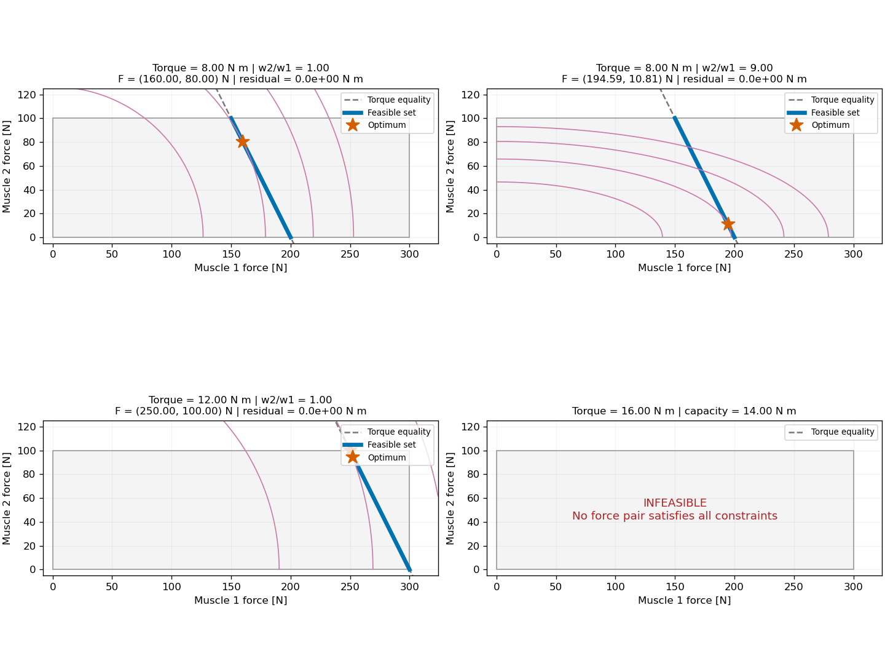

# 同一個關節力矩，為什麼可以有不同肌肉答案？

前一單元由動作計算所需力矩。現在假設需要 8 N·m，想知道兩條肌肉各出多少力。先不要開求解器：我們要先知道有哪些答案，再決定如何選。

## 1. 逆問題與最佳化是兩件事

逆問題從觀測推回未知原因；本例由關節力矩推估肌肉力。最佳化則引入一個準則，在可行選擇中選出最好的解。兩者可以結合，但最佳化選出的唯一解，不表示資料本身已唯一決定答案。

全章要反覆問：**這項結論由力矩資料決定，還是由目標函數選定？**

## 2. 用一條直線畫出所有答案

固定姿態下，兩條同向肌的力臂為 $r_1=0.04$ m、$r_2=0.02$ m。力上限為 $U_1=300$ N、$U_2=100$ N。全部為教學合成值。忽略其他產力來源，力矩平衡為

$$r_1F_1+r_2F_2=\tau=8\ \mathrm{N\,m},\qquad 0\le F_i\le U_i.$$

移項可得

$$F_2=\frac{8-0.04F_1}{0.02}=400-2F_1.$$

在橫軸 $F_1$、縱軸 $F_2$ 的圖上，這是一條直線。上下限是一個矩形；矩形內的直線部分才是可行集合。代入 $0\le F_2\le100$ 得到 $150\le F_1\le200$。端點為 $(150,100)$ 與 $(200,0)$ N。

**先預測：** $(160,80)$、$(190,20)$ 是否都可行？逐一算力矩，不要依靠看圖猜測。

一般正力臂下，可行區間為

$$F_{1,lo}=\max\left(0,\frac{\tau-r_2U_2}{r_1}\right),\quad
F_{1,hi}=\min\left(U_1,\frac{\tau}{r_1}\right).$$

下界大於上界就沒有可行解。本模型的最大力矩為 $0.04(300)+0.02(100)=14$ N·m；超過它，改目標或改求解器都不能創造肌肉能力。

## 3. 零空間：看不見的肌肉力變化

寫成 $RF=\tau$，其中 $R=[0.04\quad0.02]$ 是 $1\times2$ 矩陣，秩為 1。向量 $n=[1,-2]^T$ 滿足 $Rn=0$，因此

$$F=\begin{bmatrix}200\\0\end{bmatrix}
s\begin{bmatrix}1\\-2\end{bmatrix},\qquad -50\le s\le0.$$

$s$ 以 N 計，每增加 1 N 的第一肌肉力並減少 2 N 的第二肌肉力，淨力矩不變。資料看不見這個方向的變化。上限縮短解的集合，但本例仍有無限多個解。

這是最小版本的肌肉冗餘；肌肉比方程多不代表任何需求都可行，也不代表加入邊界後永遠有多解。例如 14 N·m 時只剩 $(300,100)$ 一點。

## 4. 最佳化多加了什麼？

先選一個目標

$$\min_F J(F)=w_1F_1^2+w_2F_2^2,\qquad w_1,w_2>0,$$

同時保留力矩平衡與上下限。$F_i$ 是決策變數，$J$ 是目標，力矩與能力範圍是約束。可行性回答能不能做到；目標回答在可行解中偏好哪個。

### 目標 A：最小力平方和

令 $w_1=w_2=1$，$J$ 的單位是 N²。等高線是圓，從原點逐漸擴大，第一次碰到可行線段的位置就是解。

### 目標 B：最小活化平方和

先明示一個簡化假設：$F_i=a_iU_i$，$0\le a_i\le1$。這裡忽略力長、力速、被動力與活化動態，所以不是完整肌肉模型。若最小化 $a_1^2+a_2^2$，換回力座標得到

$$J=\left(\frac{F_1}{300}\right)^2+\left(\frac{F_2}{100}\right)^2.$$

此時 $w_i=1/U_i^2$，$J$ 無因次，等高線成為橢圓。同樣 1 N 的增量在兩條肌肉上，代表不同的能力比例。

OpenSim 靜態最佳化也使用活化的次方和作為目標，但完整肌肉模型與設定仍影響力到活化的關係；此處只借用選解觀念。[^1]

## 5. 先用一元微積分手推解

將平衡條件消去 $F_2$：

$$J(F_1)=w_1F_1^2+\frac{w_2}{r_2^2}(\tau-r_1F_1)^2.$$

對 $F_1$ 微分，先使用鏈鎖律：

$$\frac{dJ}{dF_1}=2w_1F_1-\frac{2w_2r_1}{r_2^2}(\tau-r_1F_1).$$

令導數為零，整理為

$$\left(w_1+\frac{w_2r_1^2}{r_2^2}\right)F_1
=\frac{w_2r_1\tau}{r_2^2},$$

所以忽略區間邊界時的解為

$$F_1^0=\frac{w_2r_1\tau}{w_1r_2^2+w_2r_1^2}.$$

為何它是最小值？因為

$$\frac{d^2J}{dF_1^2}=2w_1+\frac{2w_2r_1^2}{r_2^2}>0.$$

這個一元函數處處向上彎。若 $F_1^0$ 落在可行區間外，最小值在最接近它的區間端點：

$$F_1^*=\operatorname{clip}(F_1^0,F_{1,lo},F_{1,hi}),\qquad
F_2^*=\frac{\tau-r_1F_1^*}{r_2}.$$

這裡可以 clip，是因為已消元成一元嚴格凸二次函數。不能把一般多維約束最佳化都當作逐元素截斷。

| 目標 | $F_1^*$ (N) | $F_2^*$ (N) | $(a_1,a_2)$ |
|---|---:|---:|---|
| 力平方和 | 160 | 80 | (0.5333, 0.8000) |
| 活化平方和 | 194.5946 | 10.8108 | (0.6486, 0.1081) |

兩組都符合相同資料。這個例子沒有證明人體選擇其中任何一組。凸性與最適條件後續會系統整理，可參閱 Boyd & Vandenberghe 第 2、3、4 章。[^2]

## 6. 動畫：看目標移動與能力耗盡

*圖 1：橫縱軸都是 N。虛線表示平衡直線，可行線段以粗線標出，星號為最佳點；右上角显示需求與解。不同面板的目標數值單位可能不同，不比較絕對大小。*

第一個動畫固定 8 N·m，把 $w_2/w_1$ 從 1 增加到 9。正比例縮放整個目標不改變最適解，所以比值 9 與活化平方目標等價。星號沿同一條線段移動：資料沒變，偏好變了。

第二個動畫固定力平方目標，把需求從 0 增加到 16 N·m。先看到最佳解在內部移動，再碰到第二肌肉上限，最後超過 14 N·m 而無解。這是改變問題的動畫，**不是求解器的迭代軌跡**。

兩個動畫位於 notebook，也各自匯出 HTML，可暫停與逐格查看。第一格與關鍵邊界保留靜態图。

## 7. 驗證答案，並解讀失敗

Notebook 先算解析答案，再用 SLSQP 求解同一問題。每次核對 $|RF-\tau|$、上下限與兩個答案的差距。`success=True` 是求解器狀態，不能替代這些檢查。先將變數縮放成 $z_i=F_i/U_i$，並把目標權重除以共同尺度，改善不同單位造成的數值比例。

故意輸入 16 N·m，應得到不可行的明確訊息，而非最近的點被當作精確解。若允許力矩誤差並最小化殘差，你已經改成另一個問題，必須另行說明。

下一步：把上限當成會「啟動」的約束，解釋為何邊界上的最佳解不需要原始梯度為零。這將自然導入 Lagrange 乘子與 KKT；本課尚不要求背誦它們。

## 8. 練習與來源

完成 [練習](exercises/exercises.md)，尤其是「把資料唯一性與最佳解唯一性分開」的口頭說明。

[^1]: OpenSim. [Getting Started with Static Optimization](https://opensimconfluence.atlassian.net/wiki/spaces/OpenSim/pages/53089624/Getting%2BStarted%2Bwith%2BStatic%2BOptimization)。對應活化次方和的選解目標。
[^2]: Boyd & Vandenberghe. [Convex Optimization](https://web.stanford.edu/~boyd/cvxbook/index.html)。對應凸集合、凸函數與最佳化問題的理論背景；本章算例與推導為自建。
