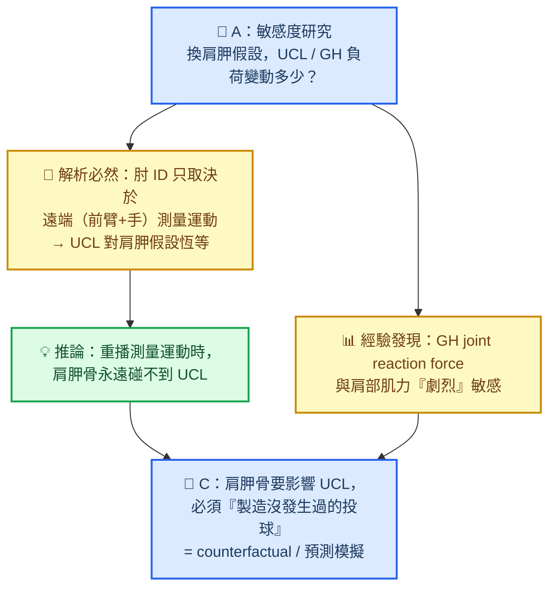
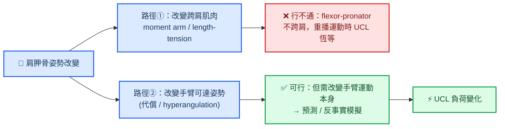
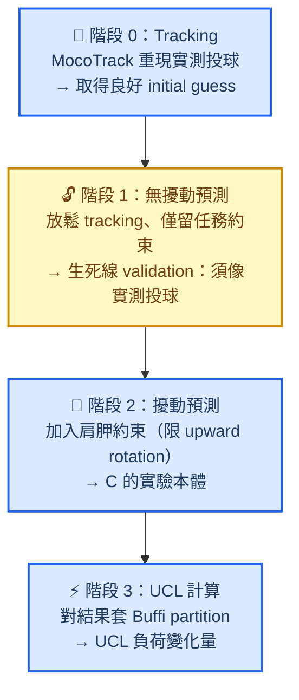

# 以 Kinatrax 驅動肌肉骨骼模型探討肩胛骨對 UCL 負荷的影響：研究構想

_棒球運動科學 × OpenSim 肌肉骨骼建模 — 腦力激盪結論摘要，2026-06-23_

---

## 🎯 研究核心問題

用球場內的 **Kinatrax**（markerless 多相機系統）取得投球全身運動學，餵入 **OpenSim 肌肉骨骼模型**，藉以理解力學從軀幹經肩胛、盂肱關節、肘關節傳遞到 **UCL（尺側副韌帶）** 的**機制**。

> 研究定位：**機制理解（mechanism understanding）**，而非臨床傷害預測。

最終想回答的科學問題：

> **當肩胛功能受限（scapular dyskinesis）、投手仍想投出同一顆球並保護肩膀時，UCL 的負荷會被如何、以及多大程度地，無聲轉嫁？**

---

## ⚠️ 三個界定全案的根本前提

這三點不是細節，而是決定整個研究方法論的地基。

| # | 前提 | 後果 |
|---|---|---|
| 1 | **Kinatrax 看不到肩胛骨** — 肩胛骨在皮下滑動，markerless（甚至體表 marker）都受 soft tissue artifact 影響 | 肩胛骨必須被「生成 / 估計」，而非「測量」。這個缺失本身就是科學問題 |
| 2 | **UCL 不是被測量的** — 而是把 elbow valgus moment 拆分為「肌肉貢獻 vs 韌帶貢獻」 | 採 Buffi et al. (2015) partition 法[^buffi]，殘餘 valgus moment 歸 UCL ＋ 骨性接觸 |
| 3 | **驗證只能體表 marker，不能植入** | 體表驗證肩胛骨僅在 ≈120° 抬舉以下、低速成立；**投球當下的肩胛骨，非植入方法全世界都驗不準** |

> 📌 核心轉念：**把領域的弱點變成研究題目。** 肩胛骨從「輸入資料」升格為「方法論主菜」。

---

## 🧩 資料現況：只有 joint angles 的意義

手上的 Kinatrax 輸出是**已處理好的 joint angles**（非底層 3D marker 軌跡）。兩者差別不在精細度，而在**「誰主導骨架模型定義」**。

| 面向 | 只有 joint angles | 有 3D marker 軌跡 |
|---|---|---|
| 模型假設 | Kinatrax 已決定（節段、關節軸、Euler 順序、肩胛處理） | 自行決定（可換模型、自訂 scaling/IK） |
| 肩胛骨 | 通常**不在輸出內** | 可放 acromion cluster 自行重建 |
| 對 inverse dynamics | 直接可跑（ID 本就吃 kinematics） | 需先跑 IK 變成角度 |

兩個後果：

- ✅ **好消息**：inverse dynamics / static optimization 本就吃 kinematics，有 joint angles 即可起跑。
- 🪤 **地雷**：Kinatrax 的關節角定義幾乎一定**不等於** OpenSim 模型座標定義（convention mismatch），這是最大的隱形誤差來源，需明確處理。

---

## 🔗 為什麼 A 必先於 C：邏輯依存，而非順序

研究拆成兩個互相依存的部分。**A 不是暖身，A 是 C 的可行性檢驗（sanity check）。**

### A 的 UCL 不變性近乎一條「定理」

Inverse dynamics 由**遠端往近端**遞迴：肘關節 net joint moment **只取決於前臂＋手的測量運動**，與其近端的肩胛、鎖骨、整個肩膀**無關**。Kinatrax 已測量前臂全域運動 → **elbow valgus moment 被資料釘死**。再加上保護 UCL 的 flexor-pronator 肌群起點在內上髁、**不跨肩**，與肩胛力學解耦 → **UCL 殘餘負荷在 A 中幾乎恆等**。

因此 A 的真正經驗貢獻是 **GH 側的劇烈敏感度**（無法事先預測），以及確立「重播運動時肩胛碰不到 UCL」這個推動 C 的結論。

---

## 🔬 子研究 A：肩胛運動學假設的敏感度

> 「Scapular kinematics assumption 對 markerless 投球分析中 GH / UCL 負荷估計的影響」

| 維度 | 設定 |
|---|---|
| **自變項**：肩胛生成法 | ① 凍結肩胛（baseline） ② Scapulohumeral rhythm 回歸（de Groot 2:1 類）[^degroot] ③ Thoracoscapular constraint（Seth et al. 2019，胸廓橢球面滑動）[^seth] ④ 人為 dyskinesis（C 的前哨） |
| **應變項** | GH joint reaction force、肩部肌肉力、**UCL 殘餘 valgus moment（Buffi 法）**、flexor-pronator 力 |
| **比較統計** | 對時間序列用 **SPM1D**（投球是動態的，勿只比 peak） |
| **資料策略** | 先用同一球員 5–10 球確認 repeatability，再擴展 |

預期結果：**換肩胛假設 → GH 負荷劇烈改變、UCL 幾乎不動。** 此為乾淨、可發表、反直覺的方法學結果，並為 C 釐清因果路徑。

---

## 🎯 子研究 C：肩胛骨如何調控傳向 UCL 的力學鏈

> 用肌肉骨骼模型，**第一次定量檢驗一個臨床廣為流傳卻幾乎未被建模的假說**：scapular dyskinesis（SICK scapula）是 UCL 受傷的近端元兇。

### 因果路徑必須講清楚

**結論：C 必須是反事實（counterfactual）模擬 —「製造一顆沒發生過的投球」。** 已選定挑戰**全預測 OpenSim Moco**[^moco]。

### 全預測 Moco 的正確問法

不從零預測（不收斂、易作弊），改為**任務約束預測**：

> 「給定同一投球任務（相同 release velocity 與 release point），當肩胛貢獻被限制時，身體如何重新解出動作？UCL 付出多少代價？」

### Cost function — 全案的靈魂

投手最佳化目標：**球速 + 避免肩部傷勢**。關鍵設計：**UCL 絕不放進 objective，僅作為 readout。**

| 項目 | 放進 objective | 角色 |
|---|---|---|
| Release velocity | ✅（建議當約束：投同一顆球） | 任務 |
| 肩部傷害風險（GH joint reaction force、rotator cuff 負荷） | ✅ 懲罰項 | 投手「在乎」的 |
| Muscle effort | ✅ 懲罰項 | 一般性 |
| **UCL 負荷** | ❌ 絕不放 | **結果 / readout** |

> 💡 **機制自動浮現**：最佳化器為了「維持球速 ＋ 保護會痛的肩膀」，會自動把負荷甩給沒被保護的肘部 UCL，無需手動指定，即重演 Tommy John 的沉默傷害機制。

> 🎁 **免費 sub-result**：把「球速 vs 肩部安全」的權重**校準到讓無擾動預測重現實測投球**，等於反推出真實投手的安全偏好，並同時完成階段 1 validation。

### Tracking → Prediction 延續法（確保收斂）

階段 1 是 predictive 版的 validation，取代了做不到的肩胛骨直接驗證。

---

## 🚧 已知風險與工程硬骨頭

| 風險 | 說明 | 因應 |
|---|---|---|
| 模型整合 | 無單一模型同時擅長肩胛（Seth）與肘部 flexor-pronator（Holzbaur/Saul）[^holzbaur]，且須 Moco 跑得動 | 自建整合模型，本身即一項貢獻 |
| 收斂困難 | 全身高速預測模擬難收斂；scapulothoracic 接觸約束增加難度 | tracking→prediction 延續法、良好 initial guess |
| 作弊動作 | 預測會鑽任何漏洞，產出物理可行但生理荒謬的動作 | 嚴格 physiological bounds ＋ 階段 1 face validity |
| Convention mismatch | Kinatrax 關節角定義 ≠ OpenSim 座標 | 明確建立座標映射並記錄 |
| 誠實度 framing | C 中肩胛骨實為「代償姿勢」之代名詞 | 於 limitation 明確交代 |

---

## ✅ 下一步

- [ ] 精讀 **Buffi et al. (2015)** — UCL partition 方法地基[^buffi]
- [ ] 取得 / 建置整合模型（Seth thoracoscapular ＋ 完整肘部肌群，Moco 相容）
- [ ] 確認 Kinatrax joint angles 是否含肩胛自由度，並建立座標映射
- [ ] 跑子研究 A：肩胛假設敏感度（SPM1D）
- [ ] 規劃 Moco 階段 0–1，先過 validation 生死線
- [ ] 文獻：scapular dyskinesis 投手的手臂運動學特徵（hyperangulation 等）

---

## 📚 參考文獻

[^buffi]: Buffi, J. H., Werner, K., Kepple, T., & Murray, W. M. (2015). Computing Muscle, Ligament, and Osseous Contributions to the Elbow Varus Moment During Baseball Pitching. _Annals of Biomedical Engineering_, 43(2), 404–415. https://doi.org/10.1007/s10439-014-1144-z

[^seth]: Seth, A., Dong, M., Matias, R., & Delp, S. (2019). Muscle Contributions to Upper-Extremity Movement and Work From a Musculoskeletal Model of the Human Shoulder. _Frontiers in Neurorobotics_, 13, 90. https://doi.org/10.3389/fnbot.2019.00090

[^degroot]: de Groot, J. H., & Brand, R. (2001). A three-dimensional regression model of the shoulder rhythm. _Clinical Biomechanics_, 16(9), 735–743. https://doi.org/10.1016/S0268-0033(01)00065-1

[^moco]: Dembia, C. L., Bianco, N. A., Falisse, A., Hicks, J. L., & Delp, S. L. (2020). OpenSim Moco: Musculoskeletal optimal control. _PLoS Computational Biology_, 16(12), e1008493. https://doi.org/10.1371/journal.pcbi.1008493

[^holzbaur]: Holzbaur, K. R. S., Murray, W. M., & Delp, S. L. (2005). A Model of the Upper Extremity for Simulating Musculoskeletal Surgery and Analyzing Neuromuscular Control. _Annals of Biomedical Engineering_, 33(6), 829–840. https://doi.org/10.1007/s10439-005-3320-7
